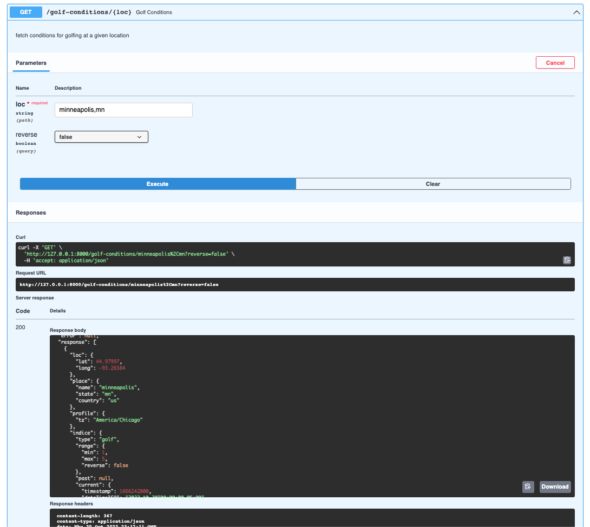
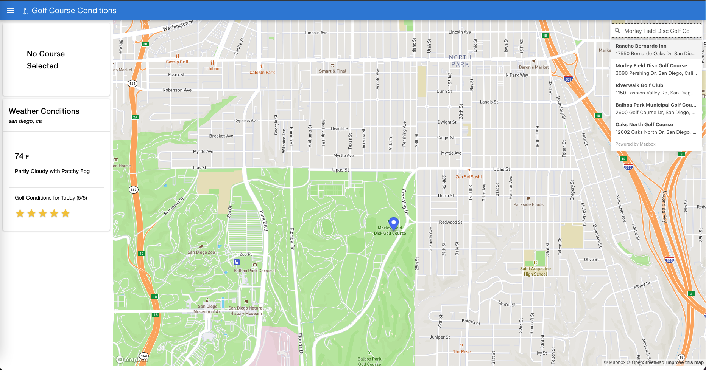

### Golf Conditions Application

This application uses the [aeris weather api](https://www.aerisweather.com/support/docs/api/reference/endpoints) to fetch weather conditions at a given location and calculates a rating based on a few factors of how ideal the weather is for playing golf.

Things analyzed are:
 * wind (30% weight)
 * temperature (30% weight)
 * precipitation (25% weight)
 * dew point (15% weight)


## The Backend API

The backend for this app was built using Python's [FastAPI](https://fastapi.tiangolo.com/) microframework.  There are two basic services, one for Weather Conditions and another to serve up Golf Courses in Minnesota.

Before you can run this project, you must make sure you have an account with [aeris weather](https://www.aerisweather.com/signup/developer/) and [mapbox](https://docs.mapbox.com/help/getting-started/access-tokens/) and you will need to create a couple `.env` files.  Create this file in and fill in the necessary variables at `/app/routers/weather/.env`:

```env
# /app/routers/weather/.env
ARIES_CLIENT_ID=<your-id>
ARIES_CLIENT_SECRET=<your-secret>
```

To run the backend:

```sh
# source your profile
source ~/.bash_profile
# activate a virtual environment
conda activate <some virtual environment>
# install the requirements for this project using the included requirements.txt file
pip install -r requirements.txt
# run app with uvicorn
uvicorn app.main:app --reload
```

By default, this will spin up on port `8000` at [http://localhost:8000](http://localhost:8000/) or you may have to use the local address (`127.0.0.1:8000`).  To view the [Swagger](https://swagger.io/tools/swagger-ui/) docs, visit:

[http://127.0.0.1:8000/docs](http://127.0.0.1:8000/docs)


or if you prefer [ReDoc](https://redocly.github.io/redoc/):

[http://127.0.0.1:8000/redoc](http://127.0.0.1:8000/redoc)


#### golf course data

The golf course data is stored in a json file [here](./app/data/All_MN_Courses.json). This data was derived from manually downloading a few json payloads from [MinnesotaGolf.com](https://minnesotagolf.com/fairways), and then using a [script](./app/scripts/crawler.js) to scrape and join data for each region and finally merge all the regions together into one data source.


### front end app

There is a [front end app](./golf-conditions/) available to use the API to find golf conditions at any given location.  When clicking on the map, a request is made to the [aeris weather conditions endpoint](https://www.aerisweather.com/support/docs/api/reference/endpoints/conditions/) looking at the next 6 hours to calculate a suitability ranking on a 1-5 scale (1=bad, 5=good) to determine the conditions for playing golf at that location:




When the [service](./app/main.py) is running, the app should be served at the default location of [http://127.0.0.1:8000/app](http://127.0.0.1:8000/app) (may have to use `localhost:8000/app`) where you can click on a golf course to see the current condition rating:


You can also use the `Geocoder` in the upper right hand corner to check on areas that are nice for playing golf year around:




#### front end app setup

To modify the front end app source code, some additional setup is requried. Make the following env file at `/golf-conditions/.env`:

```
# /golf-conditions/.env
VITE_MAPBOX_TOKEN=<your-token>
VITE_AERIS_CLIENT_ID=<your-client>
VITE_AERIS_CLIENT_SECRET=<your-secret>
VITE_APP_PUBLIC_PATH=.
```

and then a production one, where you can change the public path if hosting from an actual server:

```
# /golf-conditions/.env.production
VITE_APP_PUBLIC_PATH=..
```

then cd into the `/golf-conditions` directory and install dependencies:

```sh
cd golf-conditions
npm i
npm run dev
```

#### about the front end app

This app was build with Vue.js, TypeScript, Vite and [vue-mapbox-ts](https://gitlab.com/relief-melone/vue-mapbox-ts).

#### backend tests

test the ratings:

```sh
python -m unittest app/test/test_aeris.py
```

test the conditions (mock):
```sh
python -m pytest app/test/test_mocks.py
```